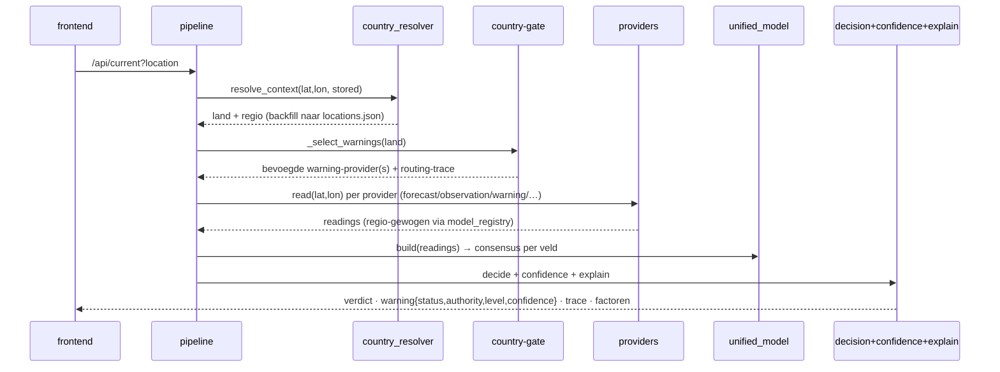
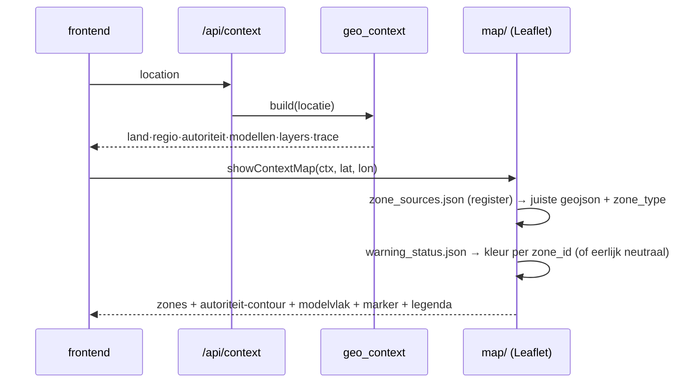

# ARCHITECTURE — Weerwijsheid (SAD-light)

Eén architectuurdocument: componenten, dataflow en de twee kernsequenties. Ontwerpkeuzes staan
als ADR in `DECISIONS.md`; dit document verwijst ernaar en herhaalt ze niet.

## 1. Doel & principes
Weerwijsheid vertaalt ruwe meteorologische data naar **één menselijke beslissing** met uitleg
waaróm, en met de **bevoegde officiële autoriteit** per land. Twee harde principes:

1. **Recht van spreken** (ADR-030): weermodellen zijn fysisch (routeren op lat/lon →
   modeldekking), waarschuwingen zijn institutioneel (routeren op lat/lon → land → autoriteit).
   Autoriteit gaat vóór ernst; een Italiaanse waarschuwing kan op Sloveens grondgebied niet
   eens meedoen.
2. **Geen schijnzekerheid**: onbekend ≠ veilig (UNAVAILABLE ≠ SAFE, ADR-030 C3); ontbrekende
   geometrie wordt landcontour + eerlijke melding, nooit verzonnen grenzen (ADR-031); zonder
   statusbron blijven kaartkleuren neutraal met "kleuren onbekend" (ADR-032).

## 2. Deployment
Eén Proxmox **LXC**, één Python-proces (Flask) dat JSON-API én statische frontend serveert.
Geen database (JSON-bestanden, ADR-001), geen containers, geen queues. Kaart gebruikt
Leaflet-CDN + OSM-tiles (internet nodig; vendoren is een optie).

## 3. Componentenoverzicht
```
                    ┌────────────────────────────────────────────────┐
                    │ backend/pipeline.py  (orkestratie + cache)     │
                    └────────────────────────────────────────────────┘
  providers/ (per ROL)          core/ (engines)                 frontend/
  ├ forecast/   Open-Meteo*     ├ country_resolver  land+regio  ├ app.js  Live-tab
  │             Windy, OpenW.   ├ region_resolver   meteo-regio ├ map/    kaart (renderer)
  ├ observation Weerlive (KNMI) ├ model_registry    gewichten   ├ theory.js leermodules
  ├ warning/    PC·ARSO·        ├ unified_model     consensus   └ map/data/ registers+geojson
  │             GeoSphere·DWD   ├ decision_engine   advies
  ├ airquality/ Open-Meteo      ├ confidence_engine zekerheid   tools/
  ├ lightning/  (stub)          ├ explainability    verdict     ├ fetch_boundaries.py   geometrie
  └ radar/      (stub)          ├ warning_status    statusmodel ├ fetch_warning_status  kleuren
     *model-aware: ECMWF/ICON/  ├ geo_context       ketenbouw   ├ verify_boundaries.py  contract
      AROME per regio           └ cap.py            CAP-parser  └ kickstart/refresh     bootstrap/cron
```
Een provider levert **readings** van canonieke velden (`wind_gust`, `cape`, `warning_level`, …)
met bron, model, rol, basisvertrouwen. Alles daarna kent alleen canonieke velden (ADR-013/014).

## 4. Sequentie 1 — advies opbouwen (`/api/current`)

Kern: de **country-gate zit vóór de aggregatie** (ADR-030 C2); `warning_authority` volgt altijd
de bron van het winnende niveau (C1); het statusmodel (C3) maakt WARNING/SAFE/UNAVAILABLE/STALE
expliciet, met `expires` uit de providers voor STALE.

## 5. Sequentie 2 — "Waarom deze bron?" + kaart

De kaart is een **renderer van geo_context** en beslist niets (ADR-030 C4/C5). Vier lagen:
officiële zones (governance) → zelfde geometrie in actuele kleur → grof modelvlak (contrast)
→ mijn locatie (point-in-polygon highlight).

## 6. Data-architectuur (zones & kleuren, ADR-031/032)
**Registry leidend, loaders per bron-type, normalisatie naar één zone-model:**
```
zone_sources.json ──► fetch_boundaries.py ──► LOADERS[loader] ──► normalize() ──► <land>.geojson
   (7 landen:              build-stap             wfs_geojson        zone_id, zone,     lokaal,
    authority, zone_type,  Mac/LXC, cron)         geojson_direct     zone_type,         runtime-
    geometry_status,                              shipped/manual     geometry_status    onafhankelijk
    bron, licentie, CRS)
zone_sources.json ──► fetch_warning_status.py ──► warning_status.json {zone_id: level}
                          (IT: DPC-bulletin · DE: DWD Warnungen_Landkreise)
```
- `zone_type` = meteorological | administrative — zichtbaar in popup én legenda (nooit een
  DWD-Warngebiet verwarren met een provincie-benadering).
- `geometry_status` = official | derived | approximation | missing — NL's 2026-overgang naar
  KNMI-polygonen is een registerwijziging, geen codewijziging.
- `zone_manifest.json` (schrijft de fetcher) + `/api/data_health` → banner in de app bij
  ontbrekende/verouderde data. Contractvalidatie: `zone.schema.json` + `verify_boundaries.py`.

## 7. Kwaliteitsbewaking
- `backend/verify_routing.py` — **governance-verifier** (geen unit test): 10 routing-cases
  (regressie Bled/Šobec/Tirol, breekpunten, collision authority>severity, no-source) + 4
  statusdemo's. PASS/FAIL/UNKNOWN, UNKNOWN ≠ FAIL. Exit 1 alleen bij FAIL (CI-poort).
- `tools/verify_boundaries.py` — elk zonebestand tegen het contract (features, properties,
  CRS-check, model-compleetheid).
- Definition of Done: beide groen vóór elke release (zie GOVERNANCE.md).

## 8. Folderstructuur (samenvatting)
```
backend/{app.py,pipeline.py,geocoding.py,verify_routing.py, core/, providers/, models/, tests/}
frontend/{index.html,app.js,theory.js,style.css, map/{map,layers,popup}.js, map/data/}
config/{locations,thresholds,regions,models}.json     tools/{kickstart,refresh,fetch_*,verify_*}
docs/{ARCHITECTURE,DECISIONS,GOVERNANCE,DATA_MANAGEMENT,INSTALLATION,API,USER_GUIDE,…}
```

## 9. Verwijzingen
Rolarchitectuur ADR-013/014 · consensus & gewichten ADR-015/020/022 · warning-governance
ADR-030 (C1 attributie, C2 country-gate, C3 statusmodel, C4 geo-context, C5 kaart) ·
zonegeometrie ADR-031 · live kleuren ADR-032 · afgewezen scope: ADR-032 §Afgewezen.
